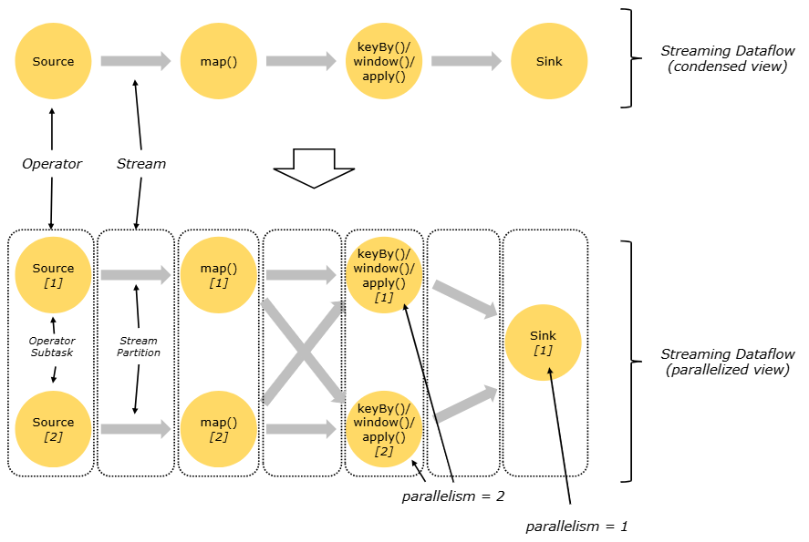

# Flink 框架概念

+ [Learn Flink: Hands-On Training](https://nightlies.apache.org/flink/flink-docs-lts/docs/learn-flink/overview/)
+ [Concepts](https://nightlies.apache.org/flink/flink-docs-lts/docs/concepts/overview/)

## Stream Processing

流 ( Stream ) 是資料的天然狀態，無論是 Web 伺服器的事件、證券交易所的交易、還是工廠車間機器的感測器讀數，資料都是作為流的一部分創建的；但是，在分析資料時，會圍繞有界資料流 ( bounded streams ) 或無界資料流 ( unbounded streams ) 來處理，而選擇哪種處理方式將產生深遠的影響。


> from [Learn Flink: Hands-On Training](https://nightlies.apache.org/flink/flink-docs-lts/docs/learn-flink/overview/)

**批次處理 ( Batch processing )** 是處理有界資料流 ( bounded streams ) 的典範；在這種處理模式下，您可以選擇先提取整個數據集，然後再產生相應的結果，這意味著您可以進行數據排序、統計數據、或產生匯總所有輸入的最終報告。

**流處理 ( Stream processing )** 是處理無界資料流 ( unbounded streams )，在概念來說，輸入可能永無止境，因此您必須在資料到達時持續處理，並且考量離散狀態下的資料處理方式。

在 Flink 中，應用程式由資料流組成，並將流入的資料經由使用者定義的算子 ( user-defined operators ) 進行轉換；這些資料流形成有向圖 ( directed graphs )，從一個或多個來源 ( Source ) 開始，到一個或多個接收器 ( Sink ) 結束。

理論上，資料流的轉換與算子是一對一的對應關係；然而，有時一個轉換流程可能包含多個算子。


> from [Learn Flink: Hands-On Training](https://nightlies.apache.org/flink/flink-docs-lts/docs/learn-flink/overview/)

Flink 的應用程式可以從串流的資料來源消費取得即時資料，如訊息佇列或分散式日誌，常見的系統如 Apache Kafka 或 Kinesis 等；亦可取得有歷史資料儲存庫的資料來源，如檔案上傳系統或物件儲存庫，常見系統如 SFTP、Minio 等；同樣，Flink 應用程式產生的結果，可在其除理流程中發送到各種接收器可連接的系統中。


> from [Learn Flink: Hands-On Training](https://nightlies.apache.org/flink/flink-docs-lts/docs/learn-flink/overview/)

## Parallel Dataflows

本質上，Flink 的程式是並行和分散式執行，在執行過程中，一個流包含一個或多個流分區，每個算子包含一個或多個算子任務；這些算子子任務彼此獨立，在不同的執行緒中執行，甚至可能在不同的主機或容器上執行。

算子子任務的數量就是該算子的並行度，同一程式的不同算子可能有不同的並行度。


> from [Learn Flink: Hands-On Training](https://nightlies.apache.org/flink/flink-docs-lts/docs/learn-flink/overview/)

+ **一對一流 ( One-to-one streams )**，其運算過程保留了算子子任務的分區和順序，例如上圖中 ```Source``` 和 ```map()``` 運算子之間，這意味著 ```map()``` 運算子的 ```subtask[1]``` 將對應 ```Source``` 運算子的 ```subtask[1]```，產生的結果有相同的順序。

+ **重新分配流 ( Redistributing streams )**，其運算過程會改變流的分區，每個算子子任務會根據所選的轉換將資料傳送到不同的目標子任務，例如上圖中 ```map()``` 和 ```keyBy/window``` 之間透過相應演算法進行重新分配，以及 ```keyBy/window``` 和 ```Sink``` 之間聚合內容，這些處理中會出現順序的不確定性。

## [Stateful Stream Processing](https://nightlies.apache.org/flink/flink-docs-lts/docs/concepts/stateful-stream-processing/)

雖然資料流中的許多操作一次只處理一個事件 ( 例如事件解析器 )，但有些操作流程會記錄多個事件的資訊 ( 例如視窗操作 )，則此操作稱為有狀態操作。

因此，Flink 需要感知狀態，以便使用檢查點和保存點來實現容錯處理。

Flink 使用流重執行和檢查點的組合來實現容錯，檢查點標記一個特定點於每個流的輸入以及操作的對應狀態；因此，資料流可以從檢查點恢復，同時透過恢復操作的狀態並從檢查點重執行記錄來保持一致性。

By default, checkpointing is disabled. See  for details on how to enable and configure checkpointing.

預設上，檢查點是禁用功能，相關細節詳見 [Checkpointing](https://nightlies.apache.org/flink/flink-docs-release-1.20/docs/dev/datastream/fault-tolerance/checkpointing/)，以啟用或設定檢查點。

## [Timely Stream Processing](https://nightlies.apache.org/flink/flink-docs-lts/docs/concepts/time/)

時間流處理 ( timely stream processing ) 是狀態流處理 ( stateful stream processing ) 的議題延伸，因時間在計算中起著一定的作用；例如，當您進行時間序列分析、基於特定時間段，或稱為時間窗 ( time window ) 來進行資料聚合與統計，亦或進行事件處理時，事件發生時間的順序重要性。

當在流程式中引用時間時，會引用以下的時間概念：

+ **處理時間**：處理時間是指執行對應操作的主機系統時間
+ **事件時間**：事件時間是指每個單獨事件在其裝置上的發生時間

支援事件時間的流處理器需要一種衡量事件時間進度的方法，例如，建立每小時的時間窗算子，並在事件時間超過一小時後收到通知，以便算子可以關閉正在進行的時間窗。

事件時間的進展可以獨立於處理時間，例如在一個程序中，算子的當前事件時間可能略微落後於處理時間 ( 考慮接收事件的延遲 )，但兩者可以相同的速度進行。或者，藉由串流處理程序用幾秒鐘的處理時間就處理了累積數週的事件時間，例如透過緩衝在 Kafka 主題 ( 或其他訊息佇列 ) 中的一些歷史資料來實現。

The mechanism in Flink to measure progress in event time is watermarks. Watermarks flow as part of the data stream and carry a timestamp t. A Watermark(t) declares that event time has reached time t in that stream, meaning that there should be no more elements from the stream with a timestamp t’ <= t (i.e. events with timestamps older or equal to the watermark).

在 Flink 中衡量事件時間進度的機制是水印 ( watermarks )，水印作為資料流的一部分流動於 Flink 系統中，並帶有時間戳 t；```Watermark(t)``` 聲明事件時間已達到該流中的時間 t，這表示流中不應再有時間戳為 ```t' <= t``` 的事件帶處理。

+ [Streaming 101: The world beyond batch](https://www.oreilly.com/radar/the-world-beyond-batch-streaming-101/)
+ [The Dataflow Model](https://static.googleusercontent.com/media/research.google.com/zh-TW//pubs/archive/43864.pdf) paper
