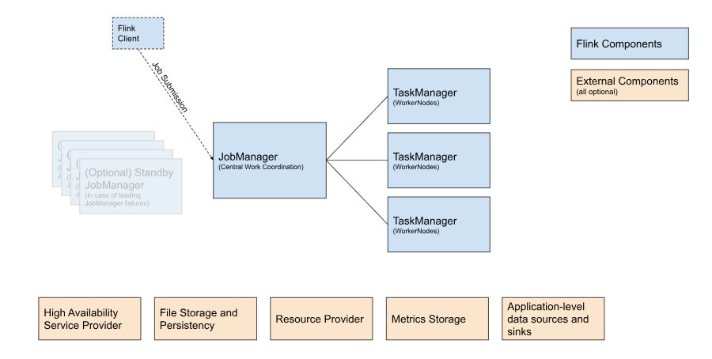

# Flink 部屬與運維

+ [Deployment](https://nightlies.apache.org/flink/flink-docs-lts/docs/deployment/overview/)
+ [Command-line interface](https://nightlies.apache.org/flink/flink-docs-lts/docs/deployment/cli/)
+ [REST API](https://nightlies.apache.org/flink/flink-docs-lts/docs/ops/rest_api/)

## Overview and Reference Architecture

對於 Flink 架構詳細參考 [Flink 架構與部屬](./architecture-and-deployment.md)，而部署 Flink 時，每個構成區塊有其用途，將在圖下列舉與說明。


> from [Deployment](https://nightlies.apache.org/flink/flink-docs-lts/docs/deployment/overview/)

### Component

+ Flink Client

將批次或串流應用程式編譯入資料流程圖，然後將其提交給 JobManager；例如 [Command-line interface](https://nightlies.apache.org/flink/flink-docs-lts/docs/deployment/cli/) 中的 Job 管理操作。

+ JobManager

JobManager 是 Fl​​ink 的核心系統，用於協調所有元件的運作；它可依據不同使用情境與可用資源，規劃不同的運作方式，從而對不同環境在高可用性、資源分配行為和支援的工作提交模式方面有不同表現。

+ TaskManager

TaskManagers 是實際執行 Flink 工作的服務。

### External Components

+ High Availability Service Provider

Flink 的 JobManager 可以運行在高可用模式下，這使得 Flink 能夠從 JobManager 故障中復原；為了更快地進行故障轉移，可以啟動多個備用 JobManager 作為備份。

+ File Storage and Persistency

對於檢查點 ( 流工作的復原機制 )，Flink 依賴外部文件儲存系統。

+ Resource Provider

Flink 可以透過不同的資源提供者框架進行部署，例如 Kubernetes 或 YARN。

+ Metrics Storage

Flink 元件會報告內部指標，Flink 作業也可以報告其他特定於作業的指標。

+ Application-level data sources and sinks

雖然從技術角度來看，應用程式層級資料來源和接收器並非 Flink 叢集元件部署的一部分，但在規劃新的 Flink 生產部署時，應考慮它們，將常用資料與 Flink 共置可以帶來顯著的效能優勢。

## Command-Line Interface

Flink 提供了一個命令列介面 ```bin/flink``` ( 在容器內可直接使用 ```flink``` )，用於運行 JAR 檔案的程式並控制其執行；CLI 是任何 Flink 設定的一部分，可在本機單節點設定和分散式設定中使用，它會連接到 Flink 設定檔中正在執行的 JobManager。

### Submitting a Job

提交工作 ( Submitting a Job ) 意味著將工作需要的 JAR 檔案及其相關相依性上傳到 Flink 叢集並啟動工作。

本範例說明，選擇一個長時間運行的作業，例如 ```examples/streaming/StateMachineExample.jar```，此檔案位於容器內 ```/opt/flink``` 目錄下的 examples 資料夾，亦可在此資料夾中選擇其他 JAR 檔案，或部署您自己的工作。

```
flink run \
  --detached \
  ./examples/streaming/StateMachineExample.jar
```

使用 --detached 提交工作將使命令在提交完成後返回，輸出包含（ 除其他資訊外 ）新提交作業的 ID，倘若未添加則會保持 stdout 的輸出狀態。

此外還有 run-application 的操作，可用來在應用程式模式 ( application mode ) 下執行作業，其功能和工作原理與 run 操作類似。

run 和 run-application 指令支援透過 -D 參數傳遞其他設定參數 ( Java 的 Jar 檔案傳遞參數規則 )，例如可以透過設定 -Dpipeline.max-parallelism=120 來設定作業的最大平行度，此參數對於配置應用程式模式叢集非常有用，因為您可以將任何配置參數傳遞給叢集而無需更改設定檔。

此外，從保存點啟動工作，其範本如下所示：

```
flink run \
      --detached \
      --fromSavepoint /tmp/flink-savepoints/$SAVEPOINT_FLIENAME \
      ./examples/streaming/StateMachineExample.jar
```

該命令與初始運行命令的區別，就在於需 --fromSavepoint 參數指定一個 Savepoint 為起始狀態，該參數可指定先前停止的作業的狀態；此外，當系統完成啟動會產生一個新的 JobID，便於用來維護該工作狀況。

從保存點啟用時，預設情況會嘗試將整個保存點狀態與正在提交的工作進行比對，倘若您想要允許跳過此比對邏輯的儲存點啟用狀態，可以設定 --allowNonRestoredState 參數；但倘若程式有刪除或修改保存點相關程式的算子操作，且仍然希望使用該保存點，則應繼續此比對邏輯。

### Terminating a Job

Another action for stopping a job is stop. It is a more graceful way of stopping a running streaming job as the stop flows from source to sink. When the user requests to stop a job, all sources will be requested to send the last checkpoint barrier that will trigger a savepoint, and after the successful completion of that savepoint, they will finish by calling their cancel() method.

停止工作 ( Terminating a Job ) 使用 stop 指令，當使用者請求停止工作時，所有來源都將被要求發送一個保存點記錄最後的狀態，並且在該保存點儲存完成後，呼叫 cancellation() 方法結束工作程序。

```
flink stop \
      --savepointPath /tmp/flink-savepoints \
      $JOB_ID
```

如果未設定 execution.checkpointing.savepoint-dir，必需使用 --savepointPath 來指定保存點資料夾。

除了停止工作外，亦可透過取消操作來取消工作：

```
flink cancel $JOB_ID
```

對應工作的狀態將從「正在執行」轉換為「已取消」，並停止所有計算；停止不會產生保存點，並且在 ```flink list --all``` 中可以看到工作為「已取消」。

### Job Monitoring

您可以使用清單操作，監視任何正在執行中的工作狀態與資訊：

```
flink list
```

若工作已提交但未啟動，則會在 “Scheduled Jobs” 的清單下。

### Savepoint

建立保存點來保存工作的目前狀態，此操作指令如下，並需提供兩個參數 JobID 和 Savepoint 目錄：

```
flink savepoint \
      $JOB_ID \
      /tmp/flink-savepoints
```

儲存點資料夾路徑為可選參數，但如果未設定 execution.checkpointing.savepoint-dir，則必需提供該參數。

此外，建立保存點的操作會依據工作狀態而等待資訊處理，這會使得客戶端收到連線逾時異常；若有此狀況，則可使用 --detached 參數，讓命令在提交完成後返回。

```
flink savepoint \
      $JOB_ID \
      /tmp/flink-savepoints
      -detached
```

保存點操作也可用於刪除保存點，以下為 --dispose 參數的操作方式：

```
flink savepoint \
      --dispose \
      /tmp/flink-savepoints/$SAVEPOINT_FLIENAME \
      $JOB_ID
```

### Checkpoint

您也可以手動建立檢查點來儲存目前狀態，其指令如下：

```
flink checkpoint \
      $JOB_ID
```

若要了解檢查點和保存點之間的區別，請參閱 [Checkpoints vs. Savepoints](https://nightlies.apache.org/flink/flink-docs-release-1.20/docs/ops/state/checkpoints_vs_savepoints/)。

## REST API

Flink 擁有一套監控 API，可用於查詢正在執行的作業以及最近完成的作業的狀態和統計資料，此監控 API 被 Flink 本身的儀錶板使用，但也被設計為可供自訂監控工具使用。

詳細可用的 REST API 參閱文獻 [API Reference](https://nightlies.apache.org/flink/flink-docs-lts/docs/ops/rest_api/#api-reference)

需要注意，其路由結構為：

```
http://[DOMAIN-NAME | IP-ADDRESS]:[PORTS]/[API-VERSION]/[API-NAME]
```

+ ```[DOMAIN-NAME | IP-ADDRESS]```：服務的域名或網址，若在本機則使用 localhost。
+ ```[PORT]```：服務的連結埠，容器預設為 8081。
+ ```[API-VERSION]```：REST API 的版本，參考文獻的描述，目前僅有 v1 選項。
+ ```[API-NAME]```：REST API 路由名稱

以此結構，執行取回本機所有工作的狀態資訊，則 REST API 如下：

```
curl http://localhost:8081/v1/jobs
```
